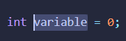
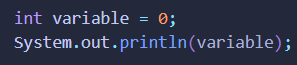
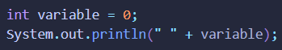

# GIMME OUTPUT

## Description
This is a simple VS-Code extension that allows users to quickly wrap variables in print statements.

## How to Use 
1. Highlight a variable in a file 

   

2. 
   Use Key Binding (ctrl + 1) for default print statement

   

   OR

   Use Key Binding (ctrl + 3) for leading string print statement
   
   
